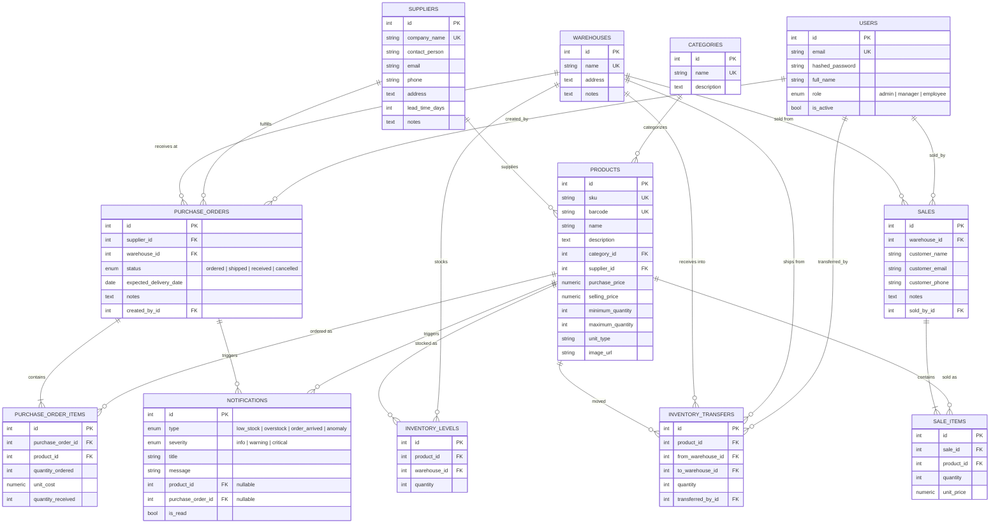

# Entity-Relationship Diagram

Generated from the SQLAlchemy models in `backend/app/models/` (see
[`schema.sql`](./schema.sql) for the same model as plain SQL DDL). Renders
natively wherever GitHub or an Artifact viewer supports Mermaid.

## Reading notes

- **`PRODUCTS` has no direct quantity column.** Stock moved into
  `INVENTORY_LEVELS` in Milestone 5 (one row per product/warehouse pair,
  unique on that pair) once multiple warehouses existed; a product's total
  stock is the sum of its `INVENTORY_LEVELS.quantity` across warehouses.
  `minimum_quantity`/`maximum_quantity` stay on `PRODUCTS` because reorder
  policy is a property of the product, not of any one warehouse.
- **`PURCHASE_ORDER_ITEMS`/`SALE_ITEMS` snapshot price at the time of the
  transaction** (`unit_cost`/`unit_price`), not a live reference to
  `PRODUCTS.purchase_price`/`selling_price` — so historical reports never
  drift if the catalog price changes later.
- **`INVENTORY_TRANSFERS` is an append-only audit log**, never updated or
  deleted, doubling as the data source for the product movement report
  (Milestone 10).
- **`NOTIFICATIONS`** links to *either* a product (`low_stock`, `overstock`,
  `anomaly`) *or* a purchase order (`order_arrived`), never both — both
  foreign keys are nullable and independent rather than a single polymorphic
  reference.
- Every table also carries `created_at`/`updated_at` (omitted above for
  readability) via the shared `TimestampMixin` — see
  `backend/app/models/base.py`.
- All four enums (`role`, `status`, `type`, `severity`) are native Postgres
  `ENUM` types, not free-text columns — see `schema.sql` for their exact
  values.
